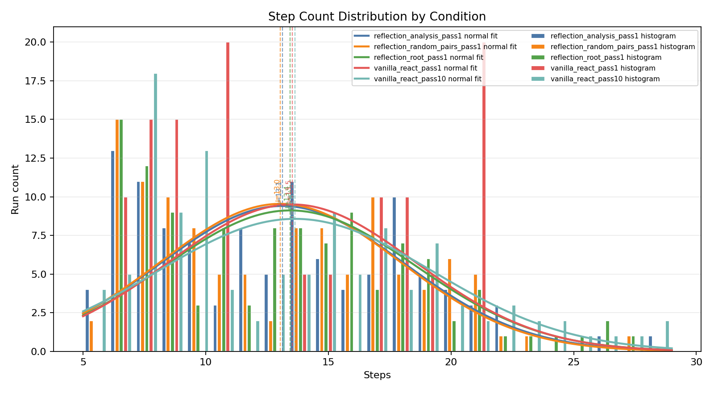
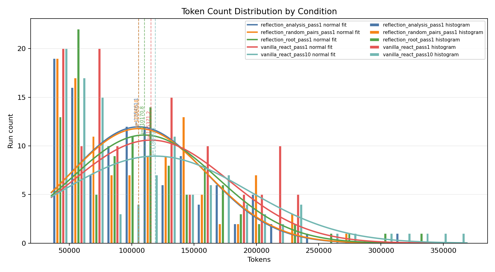

# Hypothesis 1 Pass@10 Task Subset Report

Raw run records: 589

## Subset

Only tasks with at least one completed vanilla_react_pass10 run are included. All conditions are restricted to that same task support before comparison.

- Included tasks: 23
- Excluded tasks: 2
- Excluded task IDs: fd1f8fa_2, fd1f8fa_3

## 5-Run Normalized Condition Metrics

`vanilla_react_pass10` uses the first five seeds per completed task. `vanilla_react_pass1` repeats its single seed result to five equivalent attempts per task. Reflection conditions use the first five available attempts per task.

| Condition | Attempts | Tasks | Success Rate | Macro By Task | Mean Steps | Max Steps | Mean Tokens |
| --- | ---: | ---: | ---: | ---: | ---: | ---: | ---: |
| `reflection_analysis_pass1` | 112 | 23 | 83.0% | 83.5% | 13.1 | 28 | 105461 |
| `reflection_random_pairs_pass1` | 112 | 23 | 79.5% | 80.0% | 13.0 | 27 | 105606 |
| `reflection_root_pass1` | 112 | 23 | 70.5% | 71.3% | 13.4 | 27 | 110171 |
| `vanilla_react_pass1` | 115 | 23 | 82.6% | 82.6% | 13.5 | 21 | 115371 |
| `vanilla_react_pass10` | 115 | 23 | 72.2% | 72.2% | 13.6 | 29 | 118840 |

## Vanilla ReAct Pass@10

- Tasks: 23
- Task successes: 21
- pass@10: 91.3%

## Histograms

Each figure shows side-by-side condition-specific histograms with same-color normal-distribution fits. Dashed vertical lines mark each condition mean.

## Paired Task Deltas

- `reflection_analysis_pass1` mean delta vs vanilla pass@1: 0.9%; vs vanilla pass@10: -7.8%
- `reflection_random_pairs_pass1` mean delta vs vanilla pass@1: -2.6%; vs vanilla pass@10: -11.3%
- `reflection_root_pass1` mean delta vs vanilla pass@1: -11.3%; vs vanilla pass@10: -20.0%

## Run Completeness

- Missing expected runs: 0
- Duplicate run keys: 0

Conclusion: Supported for this run set. All reflection-guided pass@1 variants underperform vanilla ReAct pass@10 on macro-by-task success.
