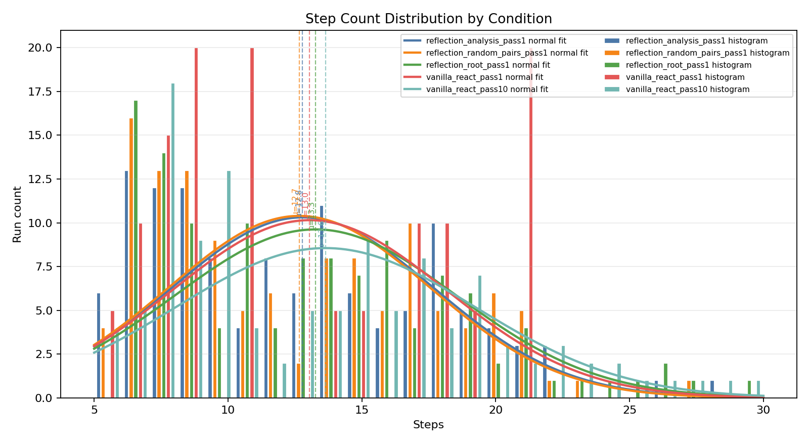
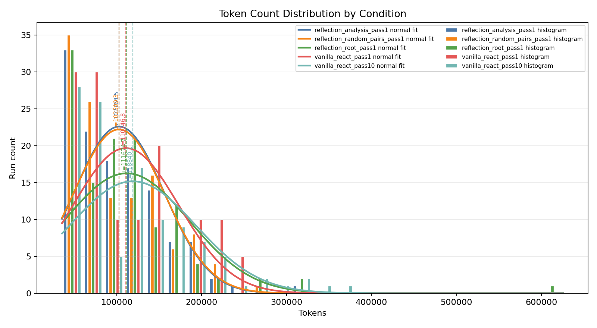

# Hypothesis 1 Report

Raw run records: 621

## 5-Run Normalized Condition Metrics

`vanilla_react_pass10` uses the first five seeds per completed task. `vanilla_react_pass1` repeats its single seed result to five equivalent attempts per task. Reflection conditions use the first five available attempts per task.

| Condition | Attempts | Tasks | Success Rate | Macro By Task | Mean Steps | Max Steps | Mean Tokens |
| --- | ---: | ---: | ---: | ---: | ---: | ---: | ---: |
| `reflection_analysis_pass1` | 122 | 25 | 80.3% | 80.8% | 12.8 | 28 | 102765 |
| `reflection_random_pairs_pass1` | 122 | 25 | 77.0% | 77.6% | 12.7 | 27 | 102599 |
| `reflection_root_pass1` | 122 | 25 | 70.5% | 71.2% | 13.3 | 30 | 111675 |
| `vanilla_react_pass1` | 125 | 25 | 80.0% | 80.0% | 13.0 | 21 | 110747 |
| `vanilla_react_pass10` | 115 | 23 | 72.2% | 72.2% | 13.6 | 29 | 118840 |

## Vanilla ReAct Pass@10

- Tasks: 23
- Task successes: 21
- pass@10: 91.3%

## Histograms

Each figure shows side-by-side condition-specific histograms with same-color normal-distribution fits. Dashed vertical lines mark each condition mean.

## Paired Task Deltas

- `reflection_analysis_pass1` mean delta vs vanilla pass@1: 0.8%; vs vanilla pass@10: -7.8%
- `reflection_random_pairs_pass1` mean delta vs vanilla pass@1: -2.4%; vs vanilla pass@10: -11.3%
- `reflection_root_pass1` mean delta vs vanilla pass@1: -8.8%; vs vanilla pass@10: -20.0%

## Run Completeness

- Missing expected runs: 20
- Duplicate run keys: 0

Conclusion: Partial-run result only. The completed records support the hypothesis so far because all reflection-guided pass@1 variants underperform observed vanilla ReAct pass@10 on macro-by-task success, but the final conclusion should wait for the remaining 20 scheduled runs.
